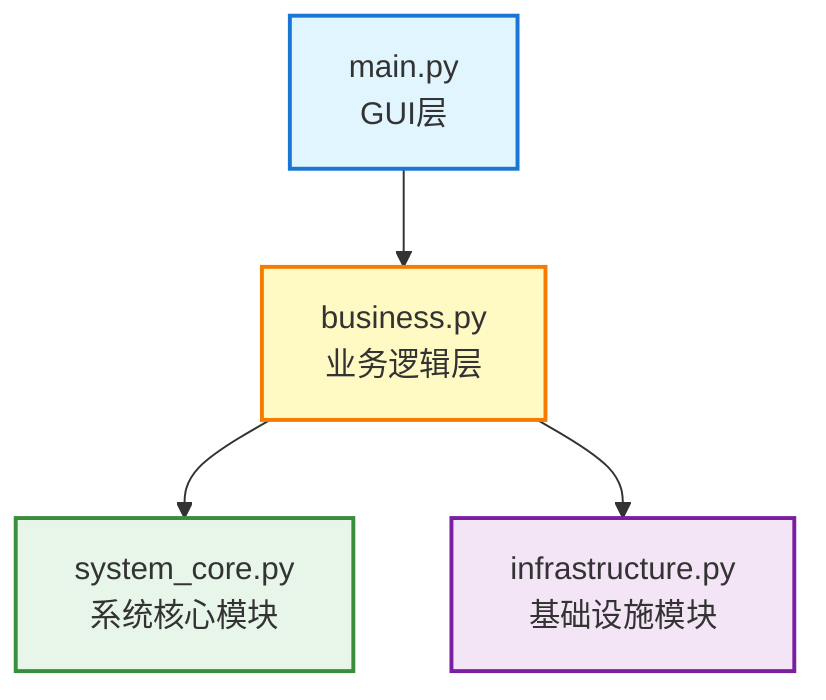

# QZCT 校园登录助手

<div align="center">

🚀 **自动登录校园网络，让您的网络连接更简单！**

[](LICENSE)
[](pyproject.toml)
[](requirements.txt)
[](README.md)

</div>

---

## 📖 目录

- [项目简介](#项目简介)
- [功能特性](#功能特性)
- [技术栈](#技术栈)
- [快速开始](#快速开始)
- [详细安装说明](#详细安装说明)
- [使用指南](#使用指南)
- [配置说明](#配置说明)
- [项目结构](#项目结构)
- [核心模块说明](#核心模块说明)
- [更新日志](#更新日志)
- [常见问题](#常见问题)
- [许可证](#许可证)
- [贡献](#贡献)
- [⭐ Star History](#star-history)
- [联系方式](#联系方式)

---

## 项目简介

QZCT 校园登录助手是一款专为校园网络设计的自动化工具，帮助您告别繁琐的手动登录操作。基于 PyQt5 开发的现代化图形界面，配合强大的定时任务系统，让您的网络连接从未如此简单。

### 为什么选择 QZCT？

| 特性 | 说明 |
|-------|------|
| ⚡ **自动化登录** | 无需每次手动输入账号密码 |
| ⏰ **定时任务** | 灵活的定时设置，按时自动连接 |
| 🔒 **安全加密** | 密码本地加密存储，保护您的隐私 |
| 📊 **状态监控** | 实时显示网络连接状态 |
| 💻 **友好界面** | 简洁直观的操作体验 |
| 📅 **智能日期** | 支持国务院官方节假日规则 |
| 🌙 **农历显示** | 内置农历日历显示 |

---

## 功能特性

### 核心功能

- ✅ 自动登录校园网络（支持电信、移动、联通、校内资源等运营商）
- ✅ WiFi自动连接与重连
- ✅ 定时关机功能
- ✅ 定时任务管理（工作日、节假日、调休规则）
- ✅ 网络状态实时监控
- ✅ 安全的密码加密存储
- ✅ 友好的图形界面

### 附加功能

- 🌙 农历日历显示（支持简化格式和完整格式）
- 📅 国务院官方节假日规则同步
- 🔄 自定义日期规则配置
- 🔧 灵活的调休上班日管理
- 📝 详细的运行日志
- 🔐 主密码保护机制
- ⚙️ 开机自启动选项
- 📅 任务日历查看

---

## 技术栈

| 技术 | 说明 |
|-------|------|
| **Python 3.13+** | 编程语言 |
| **PyQt5** | GUI 框架 |
| **requests** | 网络请求库 |
| **cryptography** | 密码加密库 |
| **zhdate** | 农历日期处理库 |
| **setuptools** | 项目打包工具 |

---

## 快速开始

### 3步快速上手

1. **安装依赖**
   ```bash
   pip install -r requirements.txt
   ```

2. **运行应用**
   ```bash
   python main.py
   ```

3. **配置并使用**
   - 设置主密码
   - 配置 WiFi 和校园网信息
   - 点击"立即执行一次"测试

---

## 详细安装说明

### 1. 克隆仓库

```bash
git clone https://github.com/taboo-hacker/qzct-login.git
cd qzct-login
```

### 2. 创建虚拟环境（推荐）

```bash
python -m venv venv

# Windows
venv\Scripts\activate

# Linux/Mac
source venv/bin/activate
```

### 3. 安装依赖

```bash
pip install -r requirements.txt
```

### 4. 运行应用

```bash
python main.py
```

---

## 使用指南

### 首次使用

1. **设置主密码**
   - 启动应用后，系统会提示您设置主密码
   - 主密码用于加密存储您的敏感信息（WiFi密码、校园网密码等）
   - 请妥善保管主密码

2. **配置基础信息**
   - 点击菜单或工具栏的「设置」按钮
   - 在「WiFi配置」中设置WiFi名称和密码
   - 在「校园网登录配置」中设置用户名、密码、运营商类型、WAN IP
     - WAN IP可以在路由器设置中查看
   - 在「自动关机配置」中设置关机时间
   - 在「自定义日期规则」中配置执行规则（可选）

3. **测试并使用**
   - 配置完成后，点击「立即执行一次」测试完整流程
   - 应用会在程序启动后自动执行一次完整任务

### 日常使用

1. **程序会自动执行**
   - 启动程序后，1秒后自动执行任务链
   - 检查执行条件 → 连接WiFi → 登录校园网 → 设置定时关机

2. **手动执行**
   - 点击「立即执行一次」按钮可以手动触发完整流程
   - 点击「测试WiFi」可以仅测试WiFi连接
   - 点击「测试登录」可以仅测试校园网登录
   - 点击「取消关机」可以取消已设置的关机任务

### 配置说明

#### WiFi配置

- **WiFi名称**：您要连接的WiFi名称（SSID）
- **WiFi密码**：WiFi密码（加密存储）
- **最大重试次数**：WiFi连接失败时的最大重试次数
- **重试间隔**：每次重试之间的间隔（秒）

#### 校园网登录配置

- **用户名**：校园网账号
- **密码**：校园网密码（加密存储）
- **运营商类型**：选择您的运营商（移动、电信、联通）
- **WAN IP**：路由器的WAN IP地址（可在路由器后台查看）

#### 自动关机配置

- **关机小时**：自动关机的小时（24小时制）
- **关机分钟**：自动关机的分钟

#### 自定义日期规则

- **启用自定义日期规则**：勾选后将使用自定义规则
- **每周执行日**：勾选需要自动执行的星期
- **自定义假期时间段**：配置强制不执行的时间段
- **自定义工作日时间段**：配置强制执行的时间段

---

## 配置说明

### 配置文件位置

配置文件会在应用启动后自动创建在项目根目录下：

- `config.json`：主配置文件
- `encryption_key.key`：加密密钥（自动生成）
- `encryption_salt.key`：加密盐值（自动生成）

### 配置文件结构

配置文件 `config.json` 包含以下主要设置：

```json
{
  "WIFI_NAME": "",
  "WIFI_PASSWORD": "",
  "MAX_WIFI_RETRY": 10,
  "RETRY_INTERVAL": 5,
  "USERNAME": "",
  "PASSWORD": "",
  "ISP_TYPE": "telecom",
  "WAN_IP": "",
  "SHUTDOWN_HOUR": 23,
  "SHUTDOWN_MIN": 0,
  "AUTOSTART": false,
  "SHOW_LUNAR_CALENDAR": true,
  "LUNAR_DISPLAY_FORMAT": 0,
  "HOLIDAY_PERIODS": [],
  "COMPENSATORY_WORKDAYS": [],
  "DATE_RULES": {}
}
```

### 安全说明

⚠️ **重要提示**：
- 密码等敏感信息在保存到 `config.json` 前会进行加密
- 主密码用于生成加密密钥，更改主密码会重新加密所有配置
- 建议在生产环境使用环境变量或其他更安全的方式管理密码

---

## 项目结构

```
qzct-login/
├── main.py                      # 主窗口程序（GUI + 主逻辑）
├── business.py                   # 业务逻辑模块
├── system_core.py                # 系统核心模块
├── infrastructure.py              # 基础设施模块
├── config.json                   # 配置文件（自动生成）
├── encryption_key.key            # 加密密钥（自动生成）
├── encryption_salt.key           # 加密盐值（自动生成）
├── reset_master_password.py       # 重置主密码工具
├── force_reset_master_password.py # 强制重置主密码工具
├── requirements.txt              # 项目依赖库列表
├── pyproject.toml                # 项目配置文件
├── README.md                     # 项目说明文档
└── LICENSE                       # 许可证文件
```

---

## 核心模块说明

| 文件名 | 作用 | 主要功能 |
|---------|------|---------|
| **main.py** | 主窗口程序 | 包含完整的GUI界面、对话框组件、主程序逻辑 |
| **business.py** | 业务逻辑模块 | WiFi连接、校园网登录、定时关机等功能实现 |
| **system_core.py** | 系统核心模块 | 配置管理、安全加密、日期规则、农历工具 |
| **infrastructure.py** | 基础设施模块 | 日志系统、线程池管理、通用工具函数 |

### 模块架构图



#### 各层功能说明

| 层级 | 文件 | 主要功能 |
|-------|------|---------|
| **GUI层** | main.py | 主窗口、对话框、用户交互 |
| **业务逻辑层** | business.py | WiFi连接、校园网登录、定时关机 |
| **系统核心层** | system_core.py | 配置管理、安全加密、日期规则、农历工具 |
| **基础设施层** | infrastructure.py | 日志系统、线程池管理、通用工具函数 |

---

## 更新日志

### v1.0.3（2026-04-05）

✨ **重大更新**

- **🔧 重构项目结构**：将多个模块融合为4个核心文件，大幅简化项目结构
  - `main.py`：主窗口程序 + 对话框组件
  - `business.py`：业务逻辑模块（WiFi、登录、关机）
  - `system_core.py`：系统核心模块（配置、安全、日期、农历）
  - `infrastructure.py`：基础设施模块（日志、线程池、工具函数）

- **🔧 修复重复日志输出**：重构任务日志机制，解决任务执行时日志重复出现的问题
  - 任务类不再直接调用 `info()`/`error()`
  - 统一通过信号发送日志
  - `TaskManager` 统一处理日志输出

- **🔧 修复配置设置崩溃**：修复打开配置设置对话框时崩溃的问题
  - 移除对已删除文件 `qzct_login.py` 的依赖
  - 修复 `QDialogButtonBox` 枚举使用问题
  - 改用普通 `QPushButton` + `QHBoxLayout`

- **📝 配置按钮中文化**：将配置设置对话框的保存和取消按钮改为中文显示
- **📝 更新日志模块名**：统一使用新的文件名作为日志模块标识
  - `main`、`business`、`system_core`、`infrastructure`

### v1.0.2（2026-04-05）

- **🔧 优化了关于我们的UI**

### v1.0.1（2026-04-05）

- **🔧 重写加密解密逻辑**

### v1.0.0（2026-04-05）

- 🎉 初始版本发布

---

## 常见问题

### Q: 主密码忘记了怎么办？
A: 可以使用 `reset_master_password.py` 或 `force_reset_master_password.py` 工具重置主密码，但请注意：重置主密码后所有已加密的配置信息将无法恢复。

### Q: 如何查看 WAN IP？
A: 可以登录路由器后台管理界面查看，通常在「网络状态」或「WAN口设置」中可以找到。

### Q: 支持哪些运营商？
A: 目前支持中国移动、中国电信、中国联通三大运营商，以及校内资源。

### Q: 程序可以在后台运行吗？
A: 目前需要保持窗口打开，最小化即可。

### Q: 如何取消定时关机？
A: 点击主界面的「取消关机」按钮即可取消已设置的关机任务。

### Q: 自定义日期规则优先生效吗？
A: 是的，勾选「启用自定义日期规则」后，自定义规则将覆盖默认节假日规则（调休上班日除外）。

### Q: 调休上班日是什么？
A: 调休上班日是指因节假日调休而需要上班的周末，在这些日期会强制执行任务。

---

## 许可证

本项目采用 [CC BY-NC-SA 4.0](LICENSE)（知识共享署名-非商业性使用-相同方式共享 4.0 国际许可协议）。

### 许可证概要

| 条款 | 说明 |
|-------|------|
| **署名 (BY)** | 您必须给出适当的署名，提供指向本许可协议的链接，并且标明是否（对原始作品）作了修改 |
| **非商业性使用 (NC)** | 您不得将本软件用于商业目的 |
| **相同方式共享 (SA)** | 如果您再混合、转换、或者基于本软件进行创作，您必须在与本许可证相同的许可证下分发您的贡献 |

详细条款请查看 [LICENSE](LICENSE) 文件或访问 [creativecommons.org/licenses/by-nc-sa/4.0](https://creativecommons.org/licenses/by-nc-sa/4.0/deed.zh)

---

## 贡献

欢迎提交 Issue 和 Pull Request 来改进这个项目！

### 贡献指南

1. Fork 本仓库
2. 创建您的特性分支 (`git checkout -b feature/AmazingFeature`)
3. 提交您的更改 (`git commit -m 'Add some AmazingFeature'`)
4. 推送到分支 (`git push origin feature/AmazingFeature`)
5. 开启一个 Pull Request


---

## 联系方式

如有问题或建议，请联系项目维护者。

---

<div align="center">

**如果这个项目对您有帮助，请给个 ⭐ Star！**

Made with ❤️ by QZCT Team

</div>

---

## ⭐ Star History

如果这个项目对您有帮助，请给个 ⭐ Star！您的支持是我们持续改进的动力！

<a href="https://star-history.com/#taboo-hacker/qzct-login&Date">
  <picture>
    <source media="(prefers-color-scheme: dark)" srcset="https://api.star-history.com/svg?repos=taboo-hacker/qzct-login&type=Date&theme=dark" />
    <source media="(prefers-color-scheme: light)" srcset="https://api.star-history.com/svg?repos=taboo-hacker/qzct-login&type=Date" />
    
  </picture>
</a>