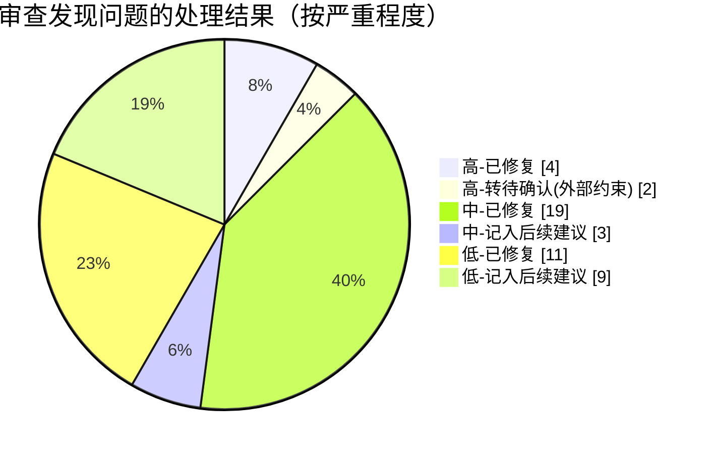

# qzct-login 全自动深度优化报告

> 由 project-auto-optimizer Skill v7.0 生成 · 2026-08-31 21:15
> 执行模式：自动执行（分析 → 方案 → 修改 → 验证 → 提交全闭环，无人工干预）

## 执行摘要

本轮优化共解决 **5 个高优先级问题**（任务链失败误报成功、零配置首次启动即设置 23:00 关机、core 层违规弹窗、主窗口核心交互零测试、文档漂移）与 **约 30 项中低优先级问题**（凭据落盘无收权、`verify=False`、临时文件竞态、包级依赖环、ISP 五处重复映射、日历与 core 的规则阶梯双实现、死代码簇约 25 个符号、状态栏时钟覆盖反馈、测试按钮无防重入、暗色主题对比度不达 WCAG AA 等），新增 23 个回归测试（309 → 330 通过），覆盖率 79.90%（门禁 70%），全程 black/isort/ruff/mypy 保持 0 问题。剩余风险集中在两件需用户决策的事项：校园网认证 HTTP 明文（网关协议限制，已加文档提示）与自签名证书安装脚本随包分发（既定设计，未改动）。

## 优化前后对比

| 维度 | 优化前 | 优化后 |
| --- | --- | --- |
| 高优先级缺陷（五个子智能体合计） | 5 项 | **0 项**（2 项转"待确认"，属外部约束） |
| `core/` 层 PySide6 依赖 | 2 处（load/save 弹窗） | **0 处**（领域层纯净，可脱离 Qt 测试） |
| utils→gui 反向依赖（包级环） | 1 处（延迟导入掩盖） | **0 处**（gui_sink 回调注入） |
| ISP 新增运营商需改动处 | 5 处 | **1 处**（ISP_MAPPING 单一数据源） |
| 日期判定优先级阶梯实现 | 2 份（core + 日历文案） | **1 份**（core/date_rules.rule_source） |
| 生产死代码 | ~25 个符号 + 3 处不可达分支 | **0** |
| config.json 凭据文件权限 | 默认继承（同用户进程可读） | icacls/chmod 600 收权至当前用户 |
| `verify=False` / 全局告警抑制 | 有 | **移除**（http 场景零影响，杜绝未来 https 静默失防） |
| 测试数量 / 主窗口核心分支 | 309 通过 / 链回调等 0 覆盖（48.99%） | **330 通过** / 链回调 6 分支、防重入、关闭流程全覆盖 |
| 暗色主题白字按钮对比度 | 2.1~3.4:1（不达 AA） | **≥5.0:1**（Material 800 色调） |
| 文档失实点 | 5 处 | **0** |
| 全仓静态检查 | 通过（既有水平） | **通过**（mypy 66 文件 0 错误、ruff/black/isort 全绿） |

## 问题分布与处理（五个子智能体审查）



## 主要变更清单

| 提交 | 类型 | 内容 |
| --- | --- | --- |
| `871c1f1` | 安全 | config.json 落盘收权（新增 infra/file_permissions.py 共享收权）；移除 `verify=False` 与全局 urllib3 告警抑制；WiFi 临时 profile 改 mkstemp fd 直写消 TOCTOU；build.py 签名指纹 40 位十六进制白名单防 PowerShell 注入 |
| `5c19f25` | 核心缺陷 | 任务链完成回调逐项核对结果（失败如实报告+关机状态说明）；零配置首次启动跳过自动执行并托盘引导；`task_connect_wifi` 区分"未配置跳过(None)"与"失败(False)"；core/config 弹窗职责上移（load 返回错误信息、save 只记日志）；清理 load 不可达分支 |
| `f0f1634` | 重构 | 日志链路依赖反转（setup_logger 收 gui_sink 回调，消除包级环与 type:ignore 私有访问）；ISP_MAPPING 迁 core/constants 扩为(后缀,显示名)单源；date_rules.rule_source 唯一阶梯（日历文案派生）；删除死代码簇（_task_registry/LogLevel/set_gui_widget/get_logger/apply_to_widget/timeout 键/FontSize 16 成员/StyleConstants/wifi 不可达 except）；interruptible_sleep 公开化；提取 _run_background_test；复活 Ctrl+,/Ctrl+K；_read_int 拆分 save_config；子进程超时常量化；shutdown 日志名统一 |
| `32b1279` | UX | 时钟独立标签不再覆盖业务反馈；测试/取消按钮防重入（含忙碌文案）；取消关机后台化+返回值检查+失败指引；登录测试成败分弹；危险确认默认"否"；退出时提醒关机仍生效；异常文案友好化；暗色主题对比度达 WCAG AA；WAN IP/假期过期文案修正 |
| `fc88361` | 测试/文档 | 新增 23 个测试（链回调 6 分支、启动跳过 3、防重入 2、关闭 2、登录失败 4、任务失败 4、版本回退 2）；9 份 _ensure_qapp 收敛 conftest；README/CODE_WIKI/DEVELOPING 同步（lunar.py、10MB 轮转、init_logger 签名、快捷键、HTTP 明文安全提示） |

共 **43 个文件**，+1085 / -571 行。备份目录：`backup/优化前-20260831-202147/`（含 manifest.json，已被 .gitignore 忽略）。

## 验证记录

- `pytest`：**330 passed, 1 skipped**（14.9s，含 GUI 用例）
- 覆盖率：**79.90%** ≥ 门禁 70%（`--cov --cov-fail-under=70`）
- `ruff check` / `ruff format --check`：0 问题
- `black --check` / `isort --check-only`：0 问题
- `mypy .`（--python-executable 双模式，PySide6 真实存根）：66 文件 **0 错误**
- 冒烟：`QT_QPA_PLATFORM=offscreen timeout 12 python main.py` → 存活 12s 无 Traceback；真实配置下任务链正常执行（暑假分支提前结束，文案符合预期）

## 待确认问题（需用户决策）

| # | 问题 | 已做 | 需决策 | 不处理的影响 |
| --- | --- | --- | --- | --- |
| 1 | 校园网认证 HTTP 明文传输（`http://192.168.51.2:801`），账号密码可被同网段截获 | 文档与 README 明示风险；移除 `verify=False` 防未来 https 时静默失防 | 若网关支持 https 需提供证书做固定（`verify=证书路径`）；无则维持现状 | 局域网攻击者可获取校园网凭据 |
| 2 | 自签名证书 + `安装签名证书.bat` 随包分发，引导用户信任自签名发布者 | 未改动（DEVELOPING.md 既定设计，属明确保留行为） | 是否改用正规 CA 代码签名证书 | 私钥泄露时代码可被冒签；用户养成装证书习惯有供应链风险 |

## 后续建议（低优先级，未自动处理）

1. **凭据加密**：config.json 密码字段改用 Windows DPAPI（如 keyring 库）——需引入新依赖，建议下个版本决策
2. **假期数据双源**：首次保存即快照 HOLIDAY_PERIODS 进配置，代码更新对老用户不生效——需数据版本化策略
3. **MainWindow 构造副作用上移** main.py（日志/配置加载编排移出窗口类，进一步改善可测性）
4. **wifi 测试接缝**：收敛模块级 `run_netsh()` 单一入口（当前测试 56 处 patch，迁移成本高收益主要是可测性）
5. 预防性性能项（审查确认当前量级无用户可感知收益）：日志投递 100-200ms 攒批、带超时任务单层化、主题切换落盘防抖、日历格式对象复用
6. 新功能类：开机自启（注册表 AUTOSTART 字段已预留）、设置"恢复默认"按钮、关机状态动态卡片
7. loguru 轮转生成的新文件收权；单实例管道加会话标识

## 一键回滚与对比

```bash
# 回滚到优化前（整个优化为 5 个提交，直接回退到基线）
git revert --no-commit 309dee9..HEAD && git commit -m "revert: 回滚 20260831 自动优化"

# 或仅恢复个别文件（备份目录含 manifest.json）
cp backup/优化前-20260831-202147/core/config.py core/config.py

# 变更统计
git diff --stat 309dee9..HEAD   # 43 files, +1085 / -571
```

## Git 提交记录

| 哈希 | 摘要 |
| --- | --- |
| `871c1f1` | fix(security): 加固凭据落盘与构建链路四处薄弱点 |
| `5c19f25` | fix(gui): 修复任务链结果误报与首次启动即设置关机两个高危缺陷 |
| `f0f1634` | refactor: 消除包级依赖环与死代码簇，ISP/日历规则收敛单一数据源 |
| `32b1279` | fix(gui): 修复状态反馈被时钟覆盖、结果误报与防重入等 10 项交互缺陷 |
| `fc88361` | test: 补齐主窗口/服务层失败分支测试，收敛 9 份重复 _ensure_qapp |
